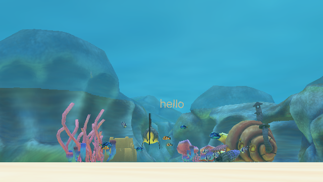

<div align="center">

# 🐠 Fish Game Alice

### *Berenang, Buru, dan Bertahan Hidup di Dasar Laut*

Sebuah game akuatik 3D sederhana yang dibangun di atas **Alice 3** kendalikan ikan besar, lahap ikan-ikan kecil, kumpulkan poin sebanyak mungkin, dan hindari predator yang mengintai di kegelapan laut.




</div>

---

## 📖 Tentang Proyek

**Fish Game Alice** adalah game edukatif bertema kehidupan bawah laut yang dikembangkan menggunakan **Alice 3**, sebuah lingkungan pemrograman visual berbasis Java yang dirancang untuk memperkenalkan konsep object-oriented programming melalui animasi 3D interaktif.

Pemain berperan sebagai seekor ikan besar yang menjelajahi terumbu karang. Tugasnya sederhana namun menegangkan: **makan ikan yang lebih kecil untuk mendapatkan poin**, sambil **menghindari ancaman dari ikan predator (hiu)** yang mengintai di sekitar area bermain. Setiap kesalahan — baik memakan objek yang salah maupun tersentuh musuh akan mengurangi nyawa pemain hingga permainan berakhir.

Proyek ini merupakan hasil pengerjaan tugas mata kuliah **Pemrograman Berorientasi Objek (PBO)**, sekaligus eksplorasi kreatif dalam merancang dunia 3D, logika permainan, dan pengalaman visual yang imersif menggunakan Alice.

---

## ✨ Fitur Utama

| Fitur | Deskripsi |
|---|---|
| 🐟 **Kontrol Ikan Pemain** | Gerakkan ikan bebas ke segala arah untuk memburu mangsa |
| 🎯 **Sistem Poin** | Setiap ikan kecil yang berhasil dimakan menambah skor |
| ❤️ **Sistem Nyawa** | Nyawa berkurang saat salah makan objek atau terkena musuh |
| 🦈 **Musuh Dinamis** | Hiu bergerak aktif sebagai ancaman yang harus dihindari |
| 🌊 **Dunia Bawah Laut Detail** | Scene dihiasi karang, gua, rumput laut, spons, kerang, hingga kastil pasir |
| 🎵 **Backsound Immersif** | Musik latar bawah laut yang menemani sepanjang permainan |
| 🐡 **Ragam Spesies Ikan** | Blue Tang, Clown Fish (Nemo), Pajama Fish (Dori), dan lainnya sebagai target buruan |

---

## 🎮 Cara Bermain

1. Buka proyek menggunakan **Alice 3** (lihat panduan instalasi di bawah).
2. Jalankan simulasi (tombol **Run**) untuk memulai permainan.
3. Kendalikan ikan besar untuk mendekati dan "memakan" ikan-ikan kecil di sekitar terumbu karang.
4. Kumpulkan poin sebanyak-banyaknya sebelum nyawamu habis.
5. Waspadai hiu — satu sentuhan darinya bisa mengurangi nyawamu!
6. Permainan berakhir ketika nyawa pemain habis. Coba kalahkan skor tertinggimu sendiri!

---

## 🧱 Struktur Proyek

```
Fish-Game-Alice/
├── projekpboFIX.a3p          # Berkas utama proyek (versi final/rekomendasi untuk dibuka)
├── save*.a3p                 # Berkas hasil penyimpanan manual selama pengembangan
├── auto*.a3p                 # Berkas hasil auto-save dari Alice IDE
├── Backsound.mp3             # Musik latar permainan
├── LICENSE                   # Lisensi MIT
└── README.md                 # Dokumentasi proyek ini
```

> 💡 **Catatan:** File `.a3p` adalah format proyek native Alice (berisi world, objek 3D, dan logika program dalam satu paket). Cukup buka `projekpboFIX.a3p` sebagai titik masuk utama proyek.

---

## 🛠️ Teknologi & Tools

- **[Alice 3](https://www.alice.org/)** `v3.9.0.2` — engine visual programming berbasis Java untuk pembuatan animasi & game 3D
- **Java** — bahasa dasar di balik runtime Alice
- Aset 3D bawaan Alice Gallery (karang, ikan, dekorasi bawah laut)

---

## ⚙️ Instalasi & Menjalankan Proyek

### Prasyarat
- **Java Development Kit (JDK)** versi 8 atau lebih baru
- **Alice 3.9** atau versi kompatibel — unduh di [alice.org](https://www.alice.org/)

### Langkah-langkah

```bash
# 1. Clone repository ini
git clone https://github.com/alnafs23/Fish-Game-Alice.git

# 2. Masuk ke folder proyek
cd Fish-Game-Alice
```

3. Buka aplikasi **Alice 3**.
4. Pilih **Open Project**, lalu arahkan ke berkas `projekpboFIX.a3p`.
5. Klik tombol **Run ▶** untuk mulai bermain.

---

## 🗺️ Roadmap Pengembangan

- [ ] Menambahkan sistem *level* dengan tingkat kesulitan bertahap
- [ ] Menambahkan efek suara saat ikan berhasil dimakan
- [ ] Menambahkan tampilan skor & nyawa yang lebih interaktif di layar
- [ ] Menambahkan lebih banyak variasi musuh laut

---

## 🤝 Kontribusi

Kontribusi, ide, dan masukan sangat terbuka! Jika ingin berkontribusi:

1. Fork repository ini
2. Buat branch baru (`git checkout -b fitur-baru`)
3. Commit perubahanmu (`git commit -m 'Menambahkan fitur baru'`)
4. Push ke branch (`git push origin fitur-baru`)
5. Buka Pull Request

---

## 📄 Lisensi

Proyek ini dilisensikan di bawah **[MIT License](LICENSE)** — bebas digunakan, dimodifikasi, dan didistribusikan dengan tetap menyertakan atribusi.

---

<div align="center">

Dibuat dengan 🐟 dan rasa ingin tahu — proyek Pemrograman Berorientasi Objek

</div>
